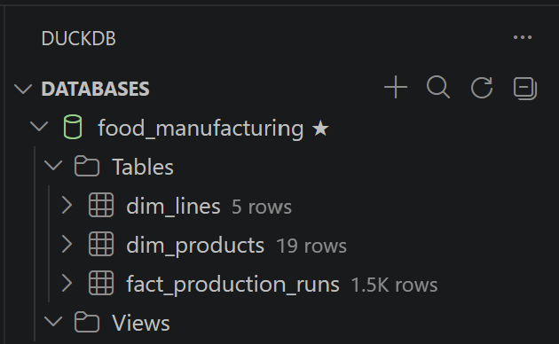

# Project Documentation

This site provides project documentation.
Use the documentation navigation to explore.

## How-To Guide

Many instructions are common to all our projects.

See
[⭐ **Workflow: Apply Example**](https://denisecase.github.io/pro-analytics-02/workflow-b-apply-example-project/)
to get the example projects running on your machine.

## Project Documentation Pages (docs/)

- **Home** - this documentation landing page
- [**Project Instructions**](./project-instructions.md)  - the standard project workflow
- [**Your Files**](./your-files.md) - how to copy the example and create your version
- [**Glossary**](./glossary.md) - project terms and concepts
- [**API**](./api.md) - autogenerated code documentation for the public project interface

## Phase 4. Technical Modification

I copied `app_case.py` to a new file, `app_abdel.py`, and added a customer revenue concentration analysis on top of the existing region and category charts.

**What I changed:** I added a new function, `top_customers_by_revenue`, that aggregates total sales by customer, identifies the top 5 customers by revenue, and calculates what percentage of total revenue those top 5 customers represent. I also added a new bar chart visualizing the top 5 customers, and a `save_current_figure` function that persists all three charts as PNG files in `artifacts/charts/`, plus exports the top-customers table as a CSV in `artifacts/top_customers.csv`.

**Why I chose this change:** The example project only shows charts in temporary pop-up windows and never saves any output to disk. A real BI workflow needs persisted artifacts that can be reused in reports, so I wanted my modification to demonstrate that practice. I also chose customer revenue concentration specifically because it's a genuine, standard BI technique (a lightweight Pareto/80-20 analysis) that goes beyond simply re-slicing the same data by a different column.

**How I verified it worked:** I ran `uv run python -m bizintel.app_abdel` and confirmed the terminal logged the correct top customer and revenue share, the three chart windows displayed correctly, and the PNG files and CSV actually appeared in the `artifacts/` folder afterward.

**What result confirmed the change:** The script identified **Jessica Mora** as the top customer with **$260,450.52** in total sales, and reported that the **top 5 customers represent 21.1% of total revenue** ($802,722.78 of $3,803,615.11). Three chart PNGs and one CSV were saved to `artifacts/`.

**Easy, moderate, or challenging:** I'd rate this moderate. Reusing the merge/groupby pattern from the existing functions was straightforward, but designing the revenue concentration calculation correctly, dividing the top N customers' summed revenue by total revenue across **all** customers, took more care, since dividing by the wrong denominator would have produced a meaningless percentage.

## Phase 5. Custom Project

For my custom project, I chose to apply the same star schema and ETVL concepts from the smart sales example to a completely different domain relevant to my work as an engineering team lead: **food manufacturing production monitoring**. Instead of tracking retail sales, this warehouse tracks production runs across manufacturing lines and food products, so an engineering or operations team can analyze output volume, defect rates, and downtime.

### Basis and Data

I generated my own raw data for this project (since it's a new domain not covered by the course's smart sales dataset), including realistic data quality issues to clean, mirroring the same kind of work done in the smart sales prepare step:

- **`production_lines_prepared.csv`** - 5 production lines across 2 plants (Springfield Plant and Riverside Plant), with line name, plant, and hourly capacity.
- **`products_prepared.csv`** - 19 food products across 5 categories (Bakery, Dairy, Snacks, Frozen, Beverages), with batch size and shelf life.
- **`production_runs_prepared.csv`** - 1,500 production run records over a 90-day window, with units produced, defect units, downtime minutes, and a derived defect rate percentage.

**Assumptions and decisions made during preparation:** The raw data included inconsistent casing and whitespace in text fields (e.g. `"  line b - baking"` instead of `"Line B - Baking"`), 8 duplicate production run rows, and 25 missing `DowntimeMinutes` values. I normalized all text casing/whitespace, dropped duplicate `RunID` rows keeping the first occurrence, and made the assumption that a missing downtime value means no downtime was recorded for that run, so I filled missing values with 0 rather than dropping those rows entirely.

**Warehouse file location and format:** `artifacts/food_manufacturing.duckdb`, a separate DuckDB file from the smart sales warehouse.

### Warehouse Design

This is a classic star schema with one fact table and two dimension tables:

- **Fact table:** `fact_production_runs` - the grain is one production run (one batch produced on one line, on one date, on one shift). Columns: `RunID` (primary key), `RunDate`, `LineID` (foreign key), `ProductID` (foreign key), `ShiftName`, `UnitsProduced`, `DefectUnits`, `DowntimeMinutes`, and a derived `DefectRatePct`.
- **Dimension tables:**
    - `dim_lines` - `LineID` (primary key), `LineName`, `Plant`, `CapacityUnitsPerHour`.
    - `dim_products` - `ProductID` (primary key), `ProductName`, `Category`, `BatchSizeKg`, `ShelfLifeDays`.

A star schema fits this data well because production runs are naturally measurable events (the fact), while lines and products are descriptive entities that provide context for analyzing those events. This mirrors the smart sales design exactly, just with a different fact and different dimensions.

### ETVL Process

- **Extract:** `etl_foodmfg.py` reads the three prepared CSV files from `data/food_data/prepared/`.
- **Transform:** Dates and numeric columns are cast to the correct types (`RunDate` to datetime, `UnitsProduced`/`DefectUnits`/`DowntimeMinutes`/`DefectRatePct` to numeric) immediately before loading, matching the pattern used in the example project's `etl_case.py`.
- **Verify:** Row counts are logged before and after loading, and a `verify_row_count` function checks that each table's actual row count matches the expected count, logging PASS or FAIL.
- **Load:** Data is inserted into `dim_lines`, `dim_products`, and `fact_production_runs`, dimension tables first so the fact table's foreign key references are valid.

**What the row counts confirmed:** All three tables loaded correctly with an exact match: `dim_lines` (5 rows), `dim_products` (19 rows), and `fact_production_runs` (1,500 rows), all logged as PASS.

### Summary

Beyond the example, I implemented an entirely separate star schema warehouse in a new domain, including generating and cleaning my own raw data, designing a new schema from scratch, writing new schema creation and ETL scripts, and writing a new analysis script (`app_foodmfg.py`) that queries the warehouse directly with SQL joins and aggregations (rather than only using pandas on raw CSVs, as the example project does).

**What the warehouse contains:** 5 production lines, 19 food products, and 1,500 production run records, fully loaded and verified.

**Key findings from the analysis:**

- **Line A - Mixing** is the highest-volume production line (808,286 units produced).
- **Frozen** products have the highest average defect rate (3.27%).
- **Night shift** has the highest total downtime (29,854 minutes).

**What I learned about data warehouse design:** The same star schema pattern, one fact table describing measurable events surrounded by dimension tables describing context, applies cleanly across very different domains. The main design skill isn't the SQL itself, but correctly identifying the grain of the fact table and deciding which attributes belong in a dimension versus which belong as a measure on the fact table.

**What kinds of real business problems a data warehouse enables:** As an engineering team lead, this kind of warehouse would let me quickly answer questions like "which line needs a maintenance review," "which product category has a quality control problem worth investigating," or "is downtime concentrated in a particular shift, pointing to a staffing or training issue," all without writing ad hoc queries against a live production database every time.

